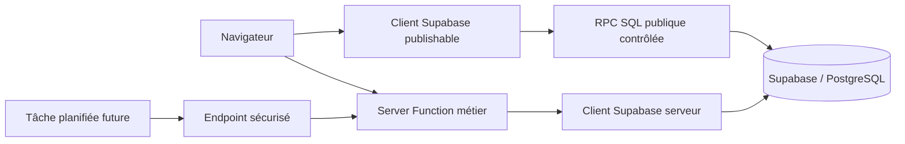

# Architecture Supabase

Dernière mise à jour : 2026-08-06

## Principe général

Toute opération métier liée à la base passe par une fonction serveur ou une RPC SQL explicitement documentée. Le navigateur ne reçoit jamais la clé `service role` et ne manipule jamais directement une table sensible.

## Les deux clients autorisés

### Client publishable

Fichier : `src/integrations/supabase/client.ts`

Variables acceptées :

- `VITE_SUPABASE_URL` ou `SUPABASE_URL`
- `VITE_SUPABASE_PUBLISHABLE_KEY` ou `SUPABASE_PUBLISHABLE_KEY`

Utilisation :

- authentification Supabase côté navigateur ;
- RPC SQL conçue pour être publique et protégée par validation/RLS ;
- aucune lecture ou écriture directe d’une table sensible sans politique RLS explicite.

### Client serveur administrateur

Fichier : `src/integrations/supabase/client.server.ts`

Variables requises côté serveur uniquement :

- `SUPABASE_URL`
- `SUPABASE_SERVICE_ROLE_KEY`

Utilisation :

- réservations et disponibilités ;
- synchronisations externes ;
- CRM lorsque l’opération n’est pas une RPC publique ;
- stockage galerie ;
- logs ;
- administration.

Règles impératives :

- import dynamique uniquement dans un fichier serveur ou un handler serveur ;
- jamais d’import dans un composant React ou un module livré au navigateur ;
- jamais de `SUPABASE_SERVICE_ROLE_KEY` dans `.env` public, `VITE_*`, GitHub ou le navigateur ;
- ne jamais contourner l’authentification admin avec cette clé.

## Répartition actuelle des domaines

| Domaine | Entrée métier | Accès Supabase | Protection |
| --- | --- | --- | --- |
| Réservations | `bookings.functions.ts` | `supabaseAdmin` | validation Zod + serveur |
| Disponibilités | `bookings.functions.ts` + iCal | `supabaseAdmin` | serveur + sources externes |
| CRM | `crm.functions.ts` | RPC `capture_crm_lead` via client publishable | validation Zod + RPC/RLS |
| Liens OTA | `ota-links.functions.ts` | `supabaseAdmin` | lecture publique filtrée, écriture admin |
| Galerie | `gallery.functions.ts` | Storage via `supabaseAdmin` | lecture publique filtrée, écriture admin |
| Logs | `logging.server.ts` | `supabaseAdmin` | écriture serveur, lecture admin |
| Agenda | `agenda-sync.server.ts`, `hyeres-area-agenda-sources.server.ts`, `agenda-admin.functions.ts` | `supabaseAdmin` | sync/admin serveur, hook planifié existant |
| Blog | fichiers Markdown dans `src/content/blog` | aucune base | build Git |

## Règle pour une nouvelle fonctionnalité

1. Déterminer si l’opération est publique, authentifiée ou admin.
2. Créer une Server Function dans `src/lib/*.functions.ts` ou un module `.server.ts`.
3. Valider toutes les entrées avec Zod.
4. Utiliser `supabaseAdmin` pour une opération serveur protégée.
5. Utiliser le client publishable uniquement pour une RPC conçue pour être publique.
6. Ajouter ou modifier la migration SQL dans `supabase/migrations/`.
7. Ajouter RLS, politiques et grants dans la même migration.
8. Ajouter des tests de lecture, d’écriture refusée et d’accès admin.
9. Ajouter un log métier pour les erreurs et les synchronisations.
10. Vérifier les variables d’environnement localement avant de tester.

## Sécurité des tables

Chaque nouvelle table doit avoir :

- RLS activé ;
- aucune politique `anon` par défaut ;
- une politique de lecture publique uniquement si le contenu est réellement public ;
- des politiques séparées pour `anon`, utilisateurs authentifiés et `service_role` ;
- des colonnes sensibles exclues des sélections publiques ;
- des contraintes SQL pour les valeurs métier importantes ;
- des index adaptés aux filtres et aux dates.

## Secrets et environnements

Les valeurs réelles restent dans les environnements d’exécution :

- local : `.env` non commité ;
- Lovable Cloud : variables serveur du projet ;
- tâche planifiée future : secrets du fournisseur de planification.

Le dépôt ne contient que les noms de variables et la documentation. Il ne contient jamais leurs valeurs.

## Synchronisation agenda et communes voisines

La synchronisation Hyères reste assurée par le collecteur existant `hyeres-agenda.server.ts`.
Les communes voisines documentées dans `reports/hyeres-area-event-coverage.md` sont ajoutées par `hyeres-area-agenda-sources.server.ts` sans remplacer ni dupliquer la source Hyères.

Accès :

- déclenchement admin : `triggerAgendaSync` dans `agenda-admin.functions.ts`, après session admin ;
- déclenchement planifié : `POST /api/public/hooks/agenda-sync`, selon le mécanisme existant du projet.

Le navigateur ne lit ni n'écrit directement les tables agenda. Les lectures publiques passent par `getPublicAgenda`, qui renvoie un DTO limité. L'écriture de synchronisation reste côté serveur via le client admin déjà prévu par l'architecture.
